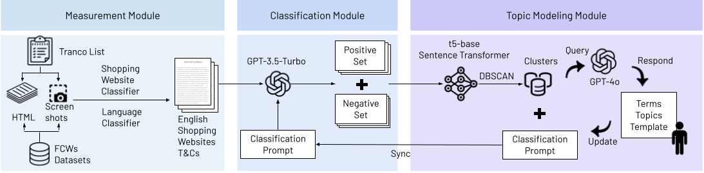

# TermMiner



Data collection and topic modeling pipeline introduced in the paper: 

**Harmful Terms and Where to Find Them: Measuring and Modeling Unfavorable Financial Terms and Conditions in Shopping Websites at Scale**

If you find this pipeline or the [ShopTC-100K dataset](https://huggingface.co/datasets/eltsai/ShopTC-100K) useful for your research, please cite our paper:
```
@inproceedings{tsai2025harmful,
  author = {Elisa Tsai and Neal Mangaokar and Boyuan Zheng and Haizhong Zheng and Atul Prakash},
  title = {Harmful Terms and Where to Find Them: Measuring and Modeling Unfavorable Financial Terms and Conditions in Shopping Websites at Scale},
  booktitle = {Proceedings of the ACM Web Conference 2025 (WWW ’25)},
  year = {2025},
  location = {Sydney, NSW, Australia},
  publisher = {ACM},
  address = {New York, NY, USA},
  pages = {14},
  month = {April 28-May 2},
  doi = {10.1145/3696410.3714573}
}
```

<details open>
  <summary><b>Table of Contents</b></summary>

1. [Installation](#installation)
2. [Configuration](#configuration)
    - [API Token](#api-token)
    - [File Structure](#file-structure)
3. [Data Collection](#data-collection)
    - [Tranco List](#tranco-list)
    - [Fetch Terms and Conditions](#fetch-terms-and-conditions)
4. [Topic Modeling](#topic-modeling)
5. [ShopTC-100K Dataset](#shoptc-100k-dataset)

</details>


# Installation

Create a Python virtual environment using e.g. Conda:
```
conda env create -f environment.yaml & conda activate tc
```

# Configuration
## API Token
Suppose your OpenAI API key is stored in `./api_token`, change the corresponding entries in [configs/measurement.yaml](https://github.com/eltsai/term_miner/blob/main/configs/measurement.yaml)


## File Structure
```
├── config.py
├── configs
│   ├── measurement.yaml
│   └── prompts
│       ├── comparison_prompt.txt
│       ├── financial_term_binary_classification_prompt.txt
│       ├── financial_term_classification_prompt.txt
│       ├── gpt_3.5_shopping_website_classification.txt
│       ├── gpt_4o_shopping_website_classification.txt
│       ├── malicious_financial_term_classification_prompt.txt
│       ├── malicious_financial_term_taxonomy.txt
│       ├── payment_page_classification.txt
│       └── term_annotation_scheme.txt
├── measurement
│   ├── 1tranco.py
│   ├── 2fetch_terms.py
│   ├── 3sanitize_terms.py
│   ├── 4cluster.py
│   ├── README.md
│   ├── tc_locator.py
│   └── website_classification.py
├── stats.py
├── terms.py
└── utils.py
```

The following folders are automatically generated when running the measurement code:

```
data/tranco/
├── clusters
├── embeddings
├── non_shopping_terms
├── output
├── sanitized
├── screenshots
├── shopping_terms
└── stats
```
To customize the default file save paths, update the settings in [configs/measurement.yaml](https://github.com/eltsai/term_miner/blob/main/configs/measurement.yaml).


# Data collection

💡 For detailed instructions on running the code, refer to [measurement/README.md](https://github.com/eltsai/term_miner/blob/main/measurement/README.md).


## Tranco List

Download the most recent Tranco List from [this link](https://tranco-list.eu/). Store it as `top-1m.csv`

## Fetch Terms and Conditions

Run:
```
python measurement/1tranco.py --start=0 --end=1000
```
to fetch the list of websites (from the Tranco list top 1000), checks their accessibility and language, takes screenshots, classifies them as shopping or non-shopping websites using a vision-based classifier, and saves the results.

Run:
```
python measurement/2fetch_terms.py --start=0 --end=1000
```
to fetch the T&C pages from the English shopping websites. 

Run:
```
python measurement/3sanitize_terms.py --start=0 --end=1000 --target=sanitized_split0.csv
```
to split terms into paragraphs.

# Topic Modeling

Run:
```
python measurement/4cluster.py --split=0 --cluster=True --chunk-num=5 --is-financial=True --eps=0.21
```
to cluster and topic model the terms.

# ShopTC-100K Dataset

We create the [ShopTC-100K dataset](https://huggingface.co/datasets/eltsai/ShopTC-100K), containing 1.8 million sanitized terms extracted from the terms and conditions of 7,777 shopping websites in the Tranco top 100K most popular websites (as of April 2024).

Download ShopTC-100K from Hugging face: 🤗 https://huggingface.co/datasets/eltsai/ShopTC-100K