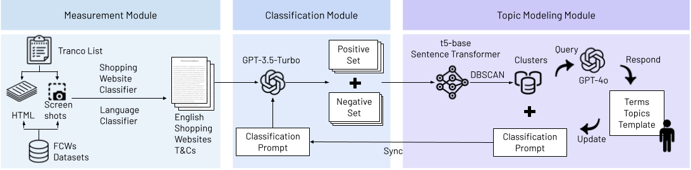

# ShopTC-100K Dataset



The ShopTC-100K dataset is collected using [TermMiner](https://github.com/eltsai/term_miner/), a data collection and topic modeling pipeline introduced in the paper: 

**Harmful Terms and Where to Find Them: Measuring and Modeling Unfavorable Financial Terms and Conditions in Shopping Websites at Scale**

To cite this dataset and related research, please use the following reference:
```
@inproceedings{tsai2025harmful,
  author = {Elisa Tsai and Neal Mangaokar and Boyuan Zheng and Haizhong Zheng and Atul Prakash},
  title = {Harmful Terms and Where to Find Them: Measuring and Modeling Unfavorable Financial Terms and Conditions in Shopping Websites at Scale},
  booktitle = {Proceedings of the ACM Web Conference 2025 (WWW ’25)},
  year = {2025},
  location = {Sydney, NSW, Australia},
  publisher = {ACM},
  address = {New York, NY, USA},
  pages = {14},
  month = {April 28-May 2},
  doi = {10.1145/3696410.3714573}
}
```

## Dataset Description

The dataset consists of sanitized terms extracted from 8,251 e-commerce websites with English-language terms and conditions. The websites were sourced from the [Tranco list](https://tranco-list.eu/) (as of April 2024). The dataset contains:

- 1,825,231 sanitized sentences
- 7,777 unique websites
- Four split files for ease of use:
```
ShopTC-100K
├── sanitized_split1.csv
├── sanitized_split2.csv
├── sanitized_split3.csv
├── sanitized_split4.csv
```

### Data Sanitization Process

The extracted terms are cleaned and structured using a multi-step sanitization pipeline:

- HTML Parsing: Raw HTML content is processed to extract text from `<p>` tags.
- Sentence Tokenization: Text is split into sentences using a transformer-based tokenization model.
- Filtering: Short sentences (<10 words) and duplicates are removed.
- Preprocessing: Newline characters and extra whitespace are cleaned.

| Split File                          | Rows    | Columns | Unique Websites |
|--------------------------------------|---------|---------|----------------|
| sanitized_split1.csv                 | 523,760 | 2       | 1,979          |
| sanitized_split2.csv                 | 454,966 | 2       | 1,973          |
| sanitized_split3.csv                 | 425,028 | 2       | 1,988          |
| sanitized_split4.csv                 | 421,477 | 2       | 1,837          |

### Example Data

The dataset is structured as follows:
| URL                   | Paragraph |
|-----------------------|----------------------------------------------------------------|
| pythonanywhere.com    | Copyright © 2011-2024 PythonAnywhere LLP — Terms of Service apply. |
| pythonanywhere.com    | We use cookies to provide social media features and to analyze our traffic. |
| pythonanywhere.com    | 2.8 You acknowledge that clicking on Links may lead to third-party sites. |
| pythonanywhere.com    | 3.4 No payment will be made unless and until Account verification is complete. |
| pythonanywhere.com    | 11.3 All licenses granted to you in this agreement are non-transferable. |


